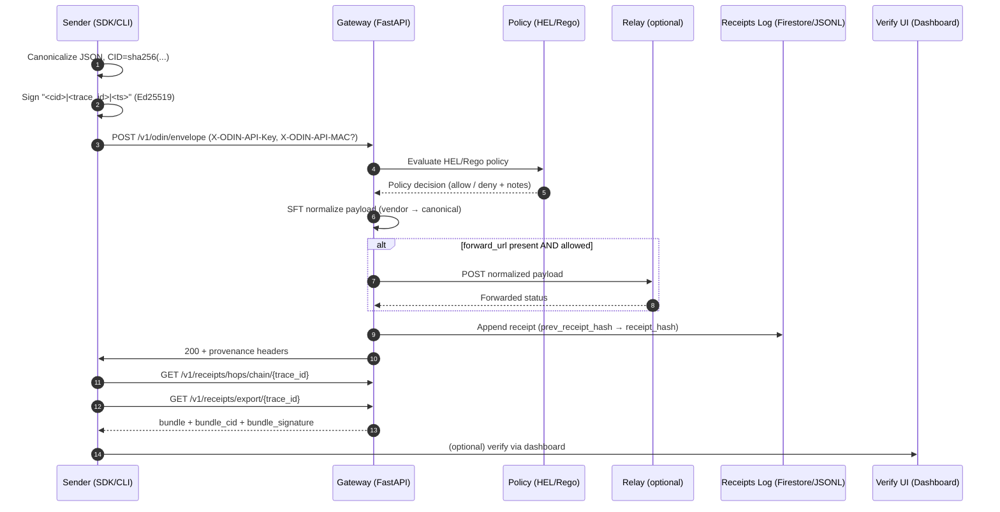

# ODIN Secure AI to AI Utility Stack

[](https://github.com/Maverick0351a/odin-gateway-starter/actions/workflows/ci.yml)
[](https://pypi.org/project/odin-sdk/)
[](https://www.npmjs.com/package/@maverick0351a/odin-sdk-js)
[](LICENSE)
[](https://cloud.google.com/partners)

> Production‑ready starter for governed, verifiable AI→AI communication using the **ODIN OPE (Open Proof Envelope)** protocol.

Core capabilities:
* Gateway + Relay services (FastAPI) with policy enforcement (HEL), schema transformation (SFT), cryptographic receipts
* ODIN Core: Ed25519 key management + JWKS, CID hashing, canonical JSON, receipt chaining (Firestore or JSONL), policy + transform engines
* Control Plane (MVP): multi-tenant API key issuance, allowlists, rate limiting, admin endpoints
* Test suite (pytest) covering health, JWKS, end-to-end envelope, export bundle, control plane, SDK flows
* Container builds (Dockerfiles) for gateway, relay, dashboard
* Dashboard (FastAPI + Jinja2) to inspect chains and verify export bundles
* SDK / CLI: Python (editable) plus early JavaScript preview
* Cloud Run deployment scripts + smoke checks
* Optional API key + HMAC layer (defense in depth)
* Vertical SFT mappings: Finance (ISO20022 invoices), Healthcare (FHIR Observation/Patient), Insurance (ACORD claim notice), Procurement (3-way match) – see `docs/sft/VERTICAL_MAPPINGS.md`

Start by opening **`AGENT.md`** and telling Copilot Chat:
> Follow AGENT.md from Task 0. Ask me for any missing env vars.

**Quick Links:**
[Quick Start](#quick-start-python-sdk--gateway) · [CLI (Py)](#cli-reference-python-sdk) · [JS SDK](#js--typescript-sdk) · [Export Verification](#export--verification-manual) · [Security](#security-notes) · [Roadmap](#roadmap)

---

## Glossary

* **OPE (Open Proof Envelope)** – Signed, canonical JSON envelope binding `cid`, `trace_id`, and timestamp providing immutable lineage across hops.
* **CID (Content Identifier)** – `sha256:<hex>` over canonical JSON of the (possibly normalized) payload; stable content hash used for signing & linkage.
* **SFT (Semantic Format Transform)** – Registry-driven mapping that normalizes vendor / tool output schemas into versioned canonical target types (e.g. tool-use → `invoice.iso20022.v1`).
* **HEL (Host Egress Limitation)** – Policy layer (allowlist / profile / Rego) enforcing which outbound hosts a payload may be forwarded to.

---

## Table of Contents

1. [Glossary](#glossary)
2. [Architecture Snapshot](#architecture-snapshot)
3. [Key Environment Variables](#key-environment-variables)
4. [Control Plane & Admin API](#control-plane--admin-api)
5. [Verification Surfaces](#verification-surfaces)
6. [Quick Start](#quick-start-python-sdk--gateway)
7. [Cloud Run Deployment](#cloud-run-deployment)
8. [CLI Reference (Python)](#cli-reference-python-sdk)
9. [JS / TypeScript SDK](#js--typescript-sdk)
10. [Tests / CI](#tests--ci)
11. [Project Layout](#project-layout)
12. [Export & Verification (Manual)](#export--verification-manual)
13. [Hosted Verify](#hosted-verify)
14. [Recipes](#recipes)
15. [Contributing](#contributing)
16. [License](#license)

---

## Architecture Snapshot

High-level flow (summary): Signed envelopes in, transformed + policy‑checked, hash‑linked receipts out, optional relay, verifiable export bundles.

<details>
<summary>Detailed step-by-step (click to expand)</summary>

1. Sender builds payload, canonicalizes JSON (sorted keys), computes CID (`sha256:<hex>`), signs `<cid>|<trace_id>|<ts>` (Ed25519).
2. Gateway resolves sender JWK (inline or cache) & verifies signature.
3. SFT maps vendor schema → canonical target (e.g. `openai.tooluse.invoice.v1` → `invoice.iso20022.v1`).
4. HEL policy validates optional `forward_url` host (per API key allowlist).
5. Receipt formed: includes normalized CID, linkage (`prev_receipt_hash`), policy result, `policy_engine` label, gateway signature.
6. Receipt persisted (Firestore or JSONL) forming an append‑only, tamper‑evident chain.
7. (Optional) Relay forwards normalized payload externally.
8. Gateway signs response `<response_cid>|<trace_id>|<receipt_ts>`; provenance headers returned.
9. Export endpoint bundles receipts, signs `<bundle_cid>|<trace_id>|<exported_at>` enabling off‑box verification.

</details>

Export endpoint: `/v1/receipts/export/{trace_id}` returns a signed bundle; clients recompute bundle CID & verify signature via JWKS. Transparency log root (experimental) available via `/healthz` for append-only monitoring.

### Sequence Diagram (Mermaid)



---

## Key Environment Variables

| Var | Purpose | Example / Notes |
|-----|---------|-----------------|
| `ODIN_SIGNER_BACKEND` | Signer backend selector | `file` (only active). Cloud backends (gcpkms, awskms, azurekv) temporarily disabled. |
| `ODIN_GCP_KMS_KEY` | Full resource name of Ed25519 KMS key version (gcpkms backend) | `projects/<p>/locations/<l>/keyRings/<r>/cryptoKeys/<k>/cryptoKeyVersions/1` |
| `ODIN_AWS_KMS_KEY_ID` | AWS KMS key id or ARN for ED25519 key (awskms backend) | `arn:aws:kms:us-east-1:123456789012:key/uuid` |
| `ODIN_AZURE_KEY_ID` | Azure Key Vault key identifier (versioned) for Ed25519 key | `https://<vault>.vault.azure.net/keys/<name>/<version>` |
| `ODIN_GATEWAY_PRIVATE_KEY_B64` | Base64url Ed25519 32‑byte seed for gateway signing (file backend) | Generated via `scripts/gen_keys.py` |
| `ODIN_GATEWAY_KID` | Key ID exposed in JWKS and headers (can be auto‑derived) | `gw-2025-01` |
| `ODIN_ADDITIONAL_PUBLIC_JWKS` | JSON string of legacy/extra JWKs for verification | `{"keys":[...]}` |
| `ODIN_POLICY_REGO_PATH` | Path to Rego policy file (enables Rego engine) | `policies/egress.rego` |
| `ODIN_POLICY_PROFILE` | Built-in policy profile overrides rego/allowlist (`strict`,`medium`,`open`) | `medium` |
| `OPA_BIN` | OPA binary name/path (when using Rego) | `opa` |
| `ODIN_MAX_SKEW_SECONDS` | Max allowed clock skew / age (seconds) for incoming envelope `ts` | `120` (default) |
| `ODIN_REPLAY_CACHE_SIZE` | Approximate in‑memory LRU size for recent message signatures to block replays | `5000` (default) |
| `HEL_ALLOWLIST` | Comma list of allowed egress hosts (HEL). For CIDRs on Cloud Run use `__SL__` instead of `/` (decoded at runtime). | `api.openai.com,postman-echo.com,10.0.0.0__SL__8` |
| `HEL_TENANT_ALLOWLISTS` | JSON map tenant → host allowlist overrides (applied per API key) | `{"tenant-123":["postman-echo.com"]}` |
| `RELAY_URL` | If set, gateway forwards normalized payloads to this relay | `http://relay:9090` |
| `RELAY_ALLOWLIST` | (Relay) Comma list of allowed outbound hosts | `api.openai.com,postman-echo.com` |
| `ODIN_API_KEY_SECRETS` | JSON map of API key → HMAC secret (legacy static mode) | `{"demo":"supersecret"}` |
| `CONTROL_PLANE_PATH` | Path to JSON state file for tenants/keys | `control_plane.json` |
| `ODIN_REQUIRE_API_KEY` | Force API key auth even if no static map set | `1` / `true` |
| `ODIN_ADMIN_TOKEN` | Enables admin endpoints when set (required token) | Strong random string |
| `FIRESTORE_PROJECT` | GCP project id; enables Firestore backend when set (ADC for auth) | `odin-ai-to` |
| `FIRESTORE_COLLECTION` | Firestore collection name | `receipts` |
| `ODIN_LOCAL_RECEIPTS` | Path for JSONL fallback store when Firestore not configured | `./data/odin_receipts.jsonl` |
| `ODIN_RETENTION_MAX_LOCAL_LINES` | Prune local JSONL receipt log above this many lines (0 = unlimited) | `50000` |
| `ODIN_RETENTION_MAX_AGE_SECONDS` | Prune local receipts older than this age (0 = unlimited) | `604800` (7 days) |
| `ODIN_TRANSPARENCY_LOG_PATH` | File path for persistence of transparency (Merkle) log leaves | `transparency.log` |
| `HOSTED_VERIFY_BASE_URL` | Public URL for dashboard verify service (docs/links) | `https://verify.example.com` |
| `CORS_ALLOW_ORIGINS` | Comma list for CORS (dashboard/API) | `https://verify.example.com,https://www.example.com` |

Set API key + MAC: client includes `X-ODIN-API-Key` + `X-ODIN-API-MAC` = base64url(HMAC_SHA256(secret, `<cid>|<trace_id>|<ts>`)).

---

## Control Plane & Admin API

Multi-tenant governance (MVP) enabling dynamic API key issuance, allowlists, and rate limiting. Backed by a simple JSON file (atomic rewrite) suitable for local / prototype; swap with DB later.

Admin authentication: provide header `X-Admin-Token: <ODIN_ADMIN_TOKEN>`.

### Endpoints
| Method | Path | Description |
|--------|------|-------------|
| GET | `/v1/admin/tenants` | List tenants (key secrets hidden) |
| POST | `/v1/admin/tenants` | Create tenant `{tenant_id,name}` |
| GET | `/v1/admin/tenants/{tenant_id}` | Fetch tenant summary |
| PATCH | `/v1/admin/tenants/{tenant_id}` | Update fields: `name`, `allowlist`, `rate_limit_rpm`, `status`, `custody_mode`, `signer_ref` |
| DELETE | `/v1/admin/tenants/{tenant_id}` | Delete tenant |
| POST | `/v1/admin/tenants/{tenant_id}/keys` | Issue API key (returns secret once) |
| POST | `/v1/admin/tenants/{tenant_id}/keys/{key}/revoke` | Revoke key |

### Request / Response Samples
Create tenant:
```bash
curl -s -X POST http://127.0.0.1:8080/v1/admin/tenants \
	-H "X-Admin-Token: $ODIN_ADMIN_TOKEN" \
	-H 'Content-Type: application/json' \
	-d '{"tenant_id":"acme","name":"Acme Corp"}' | jq
```

Issue key:
```bash
curl -s -X POST http://127.0.0.1:8080/v1/admin/tenants/acme/keys \
	-H "X-Admin-Token: $ODIN_ADMIN_TOKEN" | jq
```
Response (example):
```json
{ "key": "k_abcd...", "secret": "s_xyz...", "active": true, "created_at": "2025-08-22T12:34:56Z" }
```
Store `key` & `secret` securely; secret is not retrievable later.

Update custody (BYOK example):
```bash
curl -s -X PATCH http://127.0.0.1:8080/v1/admin/tenants/acme \
	-H "X-Admin-Token: $ODIN_ADMIN_TOKEN" \
	-H 'Content-Type: application/json' \
	-d '{"custody_mode":"byok","signer_ref":{"kty":"OKP","crv":"Ed25519","x":"<pub>","kid":"acme-byok-1"}}'
```

Custody modes:
* `odin` (default): gateway-managed key signs receipts
* `byok`: tenant supplies public JWK (future: tenant co-sign receipts)
* (Cloud backends disabled) previously: `gcpkms` / `awskms` / `azurekv` referenced cloud key id/arn/url in `signer_ref`

Roadmap: per-tenant JWKS exposure & dual-sign receipts for BYOK tenants.

### Using an Issued Key
For each envelope:
1. Build canonical message `<cid>|<trace_id>|<ts>` (same as signature payload)
2. Compute `mac = base64url( HMAC_SHA256(secret, message) )`
3. Add headers:
	 * `X-ODIN-API-Key: <key>`
	 * `X-ODIN-API-MAC: <mac>`

Python snippet (manual HMAC):
```python
import hmac, hashlib, base64
def b64u(b: bytes): return base64.urlsafe_b64encode(b).rstrip(b'=')
message = f"{cid}|{trace_id}|{ts}".encode()
mac = b64u(hmac.new(secret.encode(), message, hashlib.sha256).digest()).decode()
headers = {"X-ODIN-API-Key": key, "X-ODIN-API-MAC": mac}
```

Rate limiting: if `rate_limit_rpm > 0`, requests above that per-minute threshold return HTTP 429.

Allowlist: set `allowlist` array (hosts) via PATCH to enable per-tenant egress overrides even if global HEL would block.

Fallback static mode: if `ODIN_API_KEY_SECRETS` is set, those keys are accepted alongside dynamic keys.

Security notes:
* Always send Admin API calls over HTTPS.
* Rotate `ODIN_ADMIN_TOKEN` periodically; treat like a master credential.
* Consider isolating admin surface behind a VPN / internal ingress in production.

---

## Verification Surfaces
* JWKS: `/.well-known/jwks.json`
* Response headers: `X-ODIN-Receipt-Hash`, `X-ODIN-Response-CID`, `X-ODIN-Signature`, `X-ODIN-KID`
* Export bundle: signed pattern assures integrity + ordering
* Chain validation: each receipt's `prev_receipt_hash` must match prior's `receipt_hash`
* Policy attestation: `policy_engine` field inside each receipt identifies HEL vs Rego evaluator
* Policy profiles: set `ODIN_POLICY_PROFILE` to quickly toggle `strict` (explicit allowlist only), `medium` (adds finance host defaults), or `open` (allow all)
* Transparency log (experimental): Merkle root + size exposed via `/healthz` (`transparency.root`, `transparency.size`) for append-only monitoring
	* Persistence configurable via `ODIN_TRANSPARENCY_LOG_PATH` (if unset, in‑memory only)
	* Signed checkpoints at `/v1/transparency/checkpoint` (tune frequency by how often you call the endpoint)
* Compliance docs (draft): see `docs/compliance/` for Threat Model, Secure Development Policy, SOC 2 readiness checklist
* Signed transparency checkpoints: `/v1/transparency/checkpoint` returns a signed `(root|size|ts)` pattern (see section below)

---

## Quick Start (Python SDK + Gateway)

### 0. Environment Setup (optional but recommended)
```powershell
python -m venv .venv
./.venv/Scripts/Activate.ps1
pip install -r requirements.txt
```

### 1. Generate Gateway Keys
```powershell
python scripts/gen_keys.py
$env:ODIN_GATEWAY_PRIVATE_KEY_B64="<printed>"
$env:ODIN_GATEWAY_KID="<printed>"
```

### 2. Run Gateway
```powershell
uvicorn services.gateway.main:app --host 127.0.0.1 --port 8080
```

### 3. Install & Use SDK / CLI

```powershell
# 1. Editable install (Python SDK + CLI)
pip install -e .\packages\odin_sdk

# 2. Generate gateway signing keypair (Ed25519 seed)
python .\scripts\gen_keys.py
# Copy printed ODIN_GATEWAY_PRIVATE_KEY_B64 and ODIN_GATEWAY_KID values
$env:ODIN_GATEWAY_PRIVATE_KEY_B64="<paste>"
$env:ODIN_GATEWAY_KID="<paste>"

# 3. Run the gateway locally
uvicorn services.gateway.main:app --host 127.0.0.1 --port 8080

# 4. (Optional) Start dashboard in a second terminal
$env:GATEWAY_URL="http://127.0.0.1:8080"
uvicorn services.dashboard.main:app --host 127.0.0.1 --port 8081 --reload

# 5. Prepare a payload (example OpenAI tool-use -> ISO20022 invoice)
#    Create .\examples\openai_invoice.json then send it:
odin send --gateway-url http://127.0.0.1:8080 `
	--priv <seed> --kid demo-sender `
	--ptype openai.tooluse.invoice.v1 `
	--ttype invoice.iso20022.v1 `
	--payload-file .\examples\openai_invoice.json --print-body --json

# 6. Inspect chain + verify export
odin chain --gateway-url http://127.0.0.1:8080 --priv <seed> --kid demo-sender --trace-id <trace_id> --json
odin export-verify --gateway-url http://127.0.0.1:8080 --priv <seed> --kid demo-sender --trace-id <trace_id> --json
```

### macOS / Linux (bash) Quick Start
```bash
# venv & deps
python3 -m venv .venv && source .venv/bin/activate
pip install -r requirements.txt

# Gateway keypair
python scripts/gen_keys.py
export ODIN_GATEWAY_PRIVATE_KEY_B64="<printed>"
export ODIN_GATEWAY_KID="<printed>"

# Run gateway
uvicorn services.gateway.main:app --host 127.0.0.1 --port 8080

# Python SDK (editable install)
pip install -e packages/odin_sdk

# (Optional) export sender seed/kid if different from gateway key
# export ODIN_SENDER_PRIV_B64="<sender_seed_b64u>"
# export ODIN_SENDER_KID="sender-demo"

# Prepare example payload (ensure ./examples/openai_invoice.json exists)
# Send an envelope (uses env defaults if ODIN_SENDER_* exported)
odin send \
	--ptype openai.tooluse.invoice.v1 \
	--ttype invoice.iso20022.v1 \
	--payload-file ./examples/openai_invoice.json \
	--print-body --json
```

### Command Shortcut (using env defaults)
If you export `ODIN_GATEWAY_URL`, `ODIN_SENDER_PRIV_B64`, and `ODIN_SENDER_KID`, you can omit them:
```powershell
odin send --ptype openai.tooluse.invoice.v1 `
		  --ttype invoice.iso20022.v1 `
		  --payload-file .\examples\openai_invoice.json `
		  --print-body --json
```

JSON output (automation): add `--json` to CLI commands.

### 4. Run Dashboard (optional)
```powershell
uvicorn services.dashboard.main:app --port 8081 --reload
# open http://127.0.0.1:8081
```
Routes:
* `/` enter trace id
* `/trace/{trace_id}` chain integrity (hash + link)
* `/export/{trace_id}` bundle + signature banner, copy CID button

## Cloud Run Deployment
Prereqs:
1. Install & auth gcloud: `gcloud auth login` / `gcloud auth application-default login`
2. Enable services (once): `gcloud services enable run.googleapis.com artifactregistry.googleapis.com firestore.googleapis.com`
3. (Optional) Create Artifact Registry repo (Docker):
	```powershell
	gcloud artifacts repositories create odin --repository-format=docker --location=us-central1 --description "ODIN images"
	```

### Required Env Vars (before deploy)
```powershell
$env:ODIN_GATEWAY_PRIVATE_KEY_B64="<seed32b64u>"
$env:ODIN_GATEWAY_KID="gw-<id>"
```
Optional:
```powershell
$env:ODIN_API_KEY_SECRETS='{"demo":"supersecret"}'
$env:ODIN_ADDITIONAL_PUBLIC_JWKS='{"keys":[...]}'
$env:FIRESTORE_PROJECT="<gcp-project-id>"   # Enables Firestore backend
```

### Deploy (build + deploy gateway only)
```powershell
./scripts/deploy_cloud_run.ps1 -Project <gcp-project-id> -Region us-central1 -Build
```

### Deploy gateway + dashboard
```powershell
./scripts/deploy_cloud_run.ps1 -Project <gcp-project-id> -Region us-central1 -Build -DeployDashboard
```

Flags:
* `-Build` – run Cloud Build for images (omit to reuse existing images)
* `-DeployDashboard` – also build/deploy dashboard service
* `-Repo` – Artifact Registry repo name (default `odin`)
* `-GatewayService` / `-DashboardService` – override service names

Script outputs:
* Deployed service URL(s)
* Smoke health check result (`/healthz`)

After deploy you can test:
```powershell
Invoke-RestMethod "$env:GATEWAY_URL/healthz"
```

Export & verify remotely (example):
```powershell
odin export-verify --gateway-url <GatewayURL> --priv <seed> --kid <kid> --trace-id <trace_id> --json
```

---

## CLI Reference (Python SDK)

The Python package installs three interchangeable entry points: `odin`, `odinpy`, and `odin-sdk` (use whichever is on your PATH). Examples below use `odinpy` for clarity.

Set common env defaults (optional):
```powershell
$env:ODIN_GATEWAY_URL="http://127.0.0.1:8080"
$env:ODIN_SENDER_PRIV_B64="<sender_seed_b64url>"
$env:ODIN_SENDER_KID="sender-demo"
```

### Generate a keypair
```powershell
odinpy keygen --json
```
Outputs JSON containing: `private_key_b64`, `kid`, and a JWK (`kty=OKP, crv=Ed25519`).

### Sign (produce an envelope only)
```powershell
odinpy sign --ptype vendor.event.v1 --ttype canonical.event.v1 `
	--payload-inline '{"foo":1}' --priv $env:ODIN_SENDER_PRIV_B64 --kid $env:ODIN_SENDER_KID --json
```
Returns envelope JSON + trace_id (auto‑generated if omitted).

### Send (sign + POST to gateway)
```powershell
odinpy send --ptype vendor.event.v1 --ttype canonical.event.v1 `
	--payload-inline '{"foo":1}' --priv $env:ODIN_SENDER_PRIV_B64 --kid $env:ODIN_SENDER_KID --print-body --json
```
JSON fields:
* `trace_id` – correlate future queries
* `receipt_hash` – last appended receipt hash
* `response_cid` – CID of normalized response body

### Fetch receipt chain
```powershell
odinpy chain --trace-id <trace_id> --priv $env:ODIN_SENDER_PRIV_B64 --kid $env:ODIN_SENDER_KID --json
```
Returns ordered receipts (each includes `receipt_hash`, `prev_receipt_hash`, and normalization / policy metadata).

### Export + verify bundle
```powershell
odinpy export-verify --trace-id <trace_id> --priv $env:ODIN_SENDER_PRIV_B64 --kid $env:ODIN_SENDER_KID --json --include-bundle
```
Performs client‑side checks: hash linkage, bundle CID, Ed25519 signature (`<bundle_cid>|<trace_id>|<exported_at>`). Exit code 0 on success; 2 on verification failure.

### Fetch JWKS
```powershell
odinpy jwks --json
```

### Ping gateway
```powershell
odinpy ping --json
```

### Using stdin for payloads
```powershell
Get-Content .\examples\openai_invoice.json | odinpy send --ptype openai.tooluse.invoice.v1 `
	--ttype invoice.iso20022.v1 --payload-file - --priv $env:ODIN_SENDER_PRIV_B64 --kid $env:ODIN_SENDER_KID --json
```

### Exit codes
* 0 = success
* 1 = user / usage error
* 2 = verification failure (export-verify)

### Troubleshooting
* Command not found: ensure the Python Scripts path is on `PATH`, or invoke via `python -m odin_sdk.cli ...`
* Signature errors: confirm `--priv` matches the `kid` the gateway has in its sender JWK set (or supplied inline).
* Hash mismatch on export: verify no manual edits to receipt log; re‑request export to confirm reproducibility.

---

## JS / TypeScript SDK

Located in `packages/odin_sdk_js` (early preview). Provides `OPEClient` plus a minimal Node CLI (`bin/odin.js`).

### Install & Build
```powershell
cd packages/odin_sdk_js
npm install
npm run build
```

### Programmatic Use
```typescript
import { OPEClient } from 'odin-sdk-js';

const gateway = 'http://127.0.0.1:8080';
const seed = '<sender_seed_b64url>';      // 32‑byte Ed25519 seed (base64url, no padding)
const kid  = 'demo-sender';

const client = new OPEClient(gateway, seed, kid);
const payload = { foo: 1 };
const env = client.buildEnvelope(payload, 'vendor.event.v1', 'canonical.event.v1');
const { data, headers } = await client.sendEnvelope(env);

console.log('Trace:', env.trace_id);
console.log('Receipt Hash:', headers['x-odin-receipt-hash']);
console.log('Response CID verified:', headers['x-odin-response-cid']);
```

### Node CLI
After build:
```powershell
node bin/odin.js
```
Usage output:
```
odin JS CLI
Commands:
	sign --gateway <url> --key <b64u_seed> --kid <kid> --payload <json> [--payload-type <t>] [--target-type <t>] [--trace <id>]
	send --gateway <url> --key <b64u_seed> --kid <kid> --payload <json> [--payload-type <t>] [--target-type <t>] [--trace <id>] [--api-key <k>] [--hmac-secret <s>]
```

Examples:
```powershell
# Sign only
node bin/odin.js sign --gateway http://127.0.0.1:8080 `
	--key <seed> --kid demo-sender `
	--payload '{"foo":1}' `
	--payload-type vendor.event.v1 `
	--target-type canonical.event.v1

# Sign + send
node bin/odin.js send --gateway http://127.0.0.1:8080 `
	--key <seed> --kid demo-sender `
	--payload '{"foo":1}' `
	--payload-type vendor.event.v1 `
	--target-type canonical.event.v1
```

HMAC / API key (optional): add `--api-key <key>` and `--hmac-secret <secret>`; client will compute `X-ODIN-API-MAC` over `<cid>|<trace_id>|<ts>` and send with header `X-ODIN-API-Key`.

Planned additions: chain fetch + export verification so the JS CLI reaches full parity with Python (`odinpy chain`, `odinpy export-verify`).

## Tests / CI
```powershell
python -m pytest -q
```

GitHub Actions runs these on pushes & PRs (see badge above). Python 3.11 & 3.12 matrix. Separate workflow `npm-publish.yml` handles JS package publishing (manual dispatch or tag `js-v*`).

* Run tests: `pytest -q`
* End-to-end verify test (`tests/test_verify.py`) now uses an in-process ASGI gateway (`asgi://gateway` sentinel) avoiding network port binding for CI stability.

### JS SDK Publish
1. Set repository secret `NPM_TOKEN` (automation token with publish rights).
2. Manual prerelease:
	* GitHub UI → Actions → `npm-publish` → Run workflow (dist_tag=`next`).
3. Promote to latest:
	* Update `package.json` version.
	* Tag push: `git tag js-v0.2.0 && git push origin js-v0.2.0` (workflow auto uses `latest`).
4. Verify: `npm view @maverick0351a/odin-sdk-js dist-tags`.


Health endpoint: `/healthz` (alias `/health`). Metrics: `/metrics` (Prometheus exposition).

---

## Project Layout

```
├─ AGENT.md                     # Playbook for autonomous agent (Copilot) to operate repo
├─ README.md                    # You are here
├─ LICENSE                      # Apache 2.0
├─ requirements.txt             # Runtime + test dependencies (gateway, relay, SDK)
├─ Dockerfile.gateway           # Gateway container (FastAPI + receipts + metrics)
├─ Dockerfile.relay             # Relay container (egress proxy/policy target)
├─ Dockerfile.dashboard         # Dashboard container (UI for chains / bundles)
├─ debug_openai_mapping.py      # Utility for mapping OpenAI tool payloads
├─ scripts/
│  ├─ gen_keys.py               # Generates Ed25519 seed + KID (exports env var values)
│  └─ demo_send_envelope.py     # Example envelope submission script
├─ services/
│  ├─ __init__.py
│  ├─ gateway/
│  │  ├─ __init__.py
│  │  └─ main.py                # Gateway API implementation
│  ├─ relay/
│  │  ├─ __init__.py
│  │  └─ main.py (optional / placeholder)
│  └─ dashboard/
│     ├─ __init__.py
│     └─ main.py (FastAPI app – read‑only verify UI)
├─ packages/
│  ├─ odin_core/                # Core primitives (crypto, cid, sft, hel, receipts)
│  │  ├─ __init__.py
│  │  ├─ cid.py
│  │  ├─ crypto.py
│  │  ├─ firestore_log.py       # Firestore / JSONL receipt store abstraction
│  │  ├─ hel.py                 # Policy (HEL) allowlist checks
│  │  ├─ sft.py                 # Schema transform (SFT) logic
│  │  ├─ receipts.py            # Receipt build & chain helpers
│  │  └─ utils.py               # Canonical JSON, time helpers, etc.
│  └─ odin_sdk/                 # Python SDK + CLI (editable install)
├─ tests/
│  ├─ conftest.py               # Ensures repo root & packages on sys.path for CI
│  ├─ test_gateway.py           # Health, JWKS, envelope E2E
│  ├─ test_export.py            # Export bundle & chain integrity
│  └─ test_sdk_basic.py         # SDK client signing & verification workflow
├─ tools/
│  └─ repl/odin_repl.py         # ODIN-aware REPL leveraging OpenAI responses
└─ .github/workflows/ci.yml     # Pytest matrix (3.11 / 3.12)
```

Legend:
* Core flow lives in `services/gateway/main.py` + `packages/odin_core/`.
* The SDK depends only on the stable core primitives (no service internals).
* Adding new schema transforms: implement in `sft.py` and register mapping (see `docs/sft/VERTICAL_MAPPINGS.md`).
* Adding new policy rules: extend `PolicyEngine` in `hel.py`.

---

## Export & Verification (Manual)
1. POST envelope(s) to gateway (collect a `trace_id`).
2. GET `/v1/receipts/export/{trace_id}` → obtain `bundle`, `bundle_cid`, `bundle_signature`.
3. Recompute canonical JSON of `bundle`, sha256 → must equal `bundle_cid`.
4. Verify Ed25519 signature over `<bundle_cid>|<trace_id>|<exported_at>` using JWKS active key.
5. Inspect `chain_valid` and `receipts` link hashes.

---

## Transparency Log & Signed Checkpoints (Experimental)

The gateway maintains an append‑only Merkle transparency log of export bundle CIDs (sha256 of the `bundle_cid` string). Each export appends the hash and returns an inclusion proof allowing offline verification of that bundle's membership in the log.

Artifacts & Endpoints:
* Export response → `transparency` object: `{ leaf_index, tree_size, root, audit_path, leaf_hash }`
* Health → `/healthz` exposes current snapshot under `transparency`
* Checkpoint → `/v1/transparency/checkpoint` returns signed structure:
  ```jsonc
  {
	"root": "<hex or null>",
	"size": <int>,
	"ts": "<iso8601>",
	"pattern": "<root>|<size>|<ts>",
	"signature": "<b64u>",
	"kid": "<gateway_kid>"
  }
  ```

Signature semantics: Ed25519 over the ASCII string `<root>|<size>|<ts>` (empty root becomes leading `|`). Verify with the active gateway JWKS entry (`kid` matches).

### Inclusion Proof Verification (Python example)
```python
import hashlib, json, requests

def b64u_decode(data: str) -> bytes:
	import base64
	return base64.urlsafe_b64decode(data + '=' * (-len(data) % 4))

def verify_inclusion(leaf_hash, index, path, expected_root):
	h = leaf_hash
	for entry in path:
		sib = entry['sibling']; side = entry['side']
		if side == 'right':
			h = hashlib.sha256(bytes.fromhex(h)+bytes.fromhex(sib)).hexdigest()
		else:
			h = hashlib.sha256(bytes.fromhex(sib)+bytes.fromhex(h)).hexdigest()
	return h == expected_root

gw = 'http://127.0.0.1:8080'
trace = '<trace_id>'

# 1. Fetch export (already performed earlier); assume we have export_json
export_json = requests.get(f"{gw}/v1/receipts/export/{trace}").json()
tx = export_json['transparency']

# 2. Recompute leaf hash (sha256 over bundle_cid literal) and compare
bundle_cid = export_json['bundle_cid']
leaf_hash_local = hashlib.sha256(bundle_cid.encode()).hexdigest()
assert leaf_hash_local == tx['leaf_hash']

# 3. Verify inclusion
assert verify_inclusion(tx['leaf_hash'], tx['leaf_index'], tx['audit_path'], tx['root'])

# 4. Fetch signed checkpoint & verify signature
ckpt = requests.get(f"{gw}/v1/transparency/checkpoint").json()
pattern = ckpt['pattern']
assert pattern == f"{ckpt['root'] or ''}|{ckpt['size']}|{ckpt['ts']}"

# 5. Verify signature with JWKS
jwks = requests.get(f"{gw}/.well-known/jwks.json").json()['keys']
pub = next(k for k in jwks if k['kid'] == ckpt['kid'])
from cryptography.hazmat.primitives.asymmetric.ed25519 import Ed25519PublicKey
def jwk_to_pub(j):
	import base64
	x = base64.urlsafe_b64decode(j['x'] + '=' * (-len(j['x']) % 4))
	return Ed25519PublicKey.from_public_bytes(x)
pub_key = jwk_to_pub(pub)
sig = b64u_decode(ckpt['signature'])
pub_key.verify(sig, pattern.encode())  # raises if invalid
```

Failure considerations:
* If inclusion verification fails, either the export data was tampered or you're using a checkpoint/root from a different log state.
* A checkpoint with root R and size N should never be followed by a later checkpoint with a different root for the same size (append‑only violation).

Roadmap enhancements:
* Consistency proofs between checkpoints
* Periodic signed checkpoints persisted & optionally anchored externally (e.g., blockchain or public notary)
* Retention windows & rollover segments (with hash linking across segments)

---

---

## Hosted Verify

The dashboard now exposes a public verification utility.

> Deployment: After deploying the dashboard (e.g. Cloud Run) set `HOSTED_VERIFY_BASE_URL` (optional) and update docs/packages to point users here. Example: `https://odin-verify.example.com`.

Set `HOSTED_VERIFY_BASE_URL` during deployment to advertise a canonical URL (e.g. Cloud Run custom domain).

### Recommended Domain Layout

| Purpose | Suggested Domain | Notes |
|---------|------------------|-------|
| Gateway API | `api.odinprotocol.dev` | Primary ingestion & export endpoints |
| Hosted Verify | `verify.odinprotocol.dev` | Dashboard + `/verify/*` JSON APIs |
| (Optional) Marketing | `www.odinprotocol.dev` | Static site / docs redirect |
| (Optional) Relay | `relay.odinprotocol.dev` | Outbound normalization/egress service |

### Deploy & Map Domains (Cloud Run)

1. Build & deploy services (gateway + dashboard):
```powershell
./scripts/deploy_cloud_run.ps1 -Project <gcp-project> -Region us-central1 -Build -DeployDashboard -MapDomains `
	-ApiDomain api.odinprotocol.dev -VerifyDomain verify.odinprotocol.dev
```
2. Script attempts domain mappings; fetch required DNS records:
```powershell
gcloud run domain-mappings list --region us-central1 --format json | ConvertTo-Json -Depth 6
```
3. Create DNS records at your registrar (A/AAAA or CNAME targets as instructed).
4. Wait for certificate provisioning (5–15 min). Test:
```powershell
Invoke-RestMethod https://verify.odinprotocol.dev/healthz
```
5. Update SDK / README references to final URLs.

### CORS Configuration
If browser JS or cross-origin verification needed, set:
```powershell
$env:CORS_ALLOW_ORIGINS="https://verify.odinprotocol.dev,https://www.odinprotocol.dev"
```
The deploy script passes this to Cloud Run when present.

Example (PowerShell):
```powershell
$env:HOSTED_VERIFY_BASE_URL="https://verify.example.com"
```

Placeholder public URL (replace after deploy): `https://YOUR-VERIFY-DOMAIN/`.

Frontend embed note: if you plan to call the verify JSON endpoints directly from a browser SPA on another origin, ensure that origin is present in `CORS_ALLOW_ORIGINS` (comma separated). Without correct CORS headers, fetch() calls will fail preflight even though curl works.

Routes:
* `/verify/{trace_id}` – JSON API: fetches export bundle from the gateway, recomputes bundle CID, validates receipt chain, and verifies signature variants ( `<bundle_cid>|<trace_id>|<exported_at>` or CID‑only fallback ).
* `POST /verify/bundle` – Upload a bundle JSON file (optionally supply `gateway_url` + `kid`) to verify offline.
* `/verify` (HTML) – UI page with trace lookup + bundle upload.

JSON response fields:
```jsonc
{
	"trace_id": "...",
	"bundle_cid": "sha256:...",    // recomputed locally
	"chain_ok": true,              // receipt hashes + linkage valid
	"sig_ok": true,                // signature verified against JWKS
	"sig_variant": "cid|trace|exported_at", // matched signing pattern
	"count": 3,                    // receipt count
	"gateway_kid": "gw-2025-01"
}
```

Usage (PowerShell examples):
```powershell
# Trace verification (JSON)
Invoke-RestMethod "http://127.0.0.1:8081/verify/$trace_id?gateway_url=http://127.0.0.1:8080" | ConvertTo-Json -Depth 5

# Bundle upload
Invoke-RestMethod -Method Post -Uri "http://127.0.0.1:8081/verify/bundle?gateway_url=http://127.0.0.1:8080&kid=$env:ODIN_GATEWAY_KID" -InFile .\bundle.json -ContentType application/json
```

Integrators can embed these endpoints in CI to attest chain integrity for compliance or auditing pipelines.

---

## Recipes

### Quick Connect (Python SDK + Control Plane)
```python
from odin_sdk.client import OPEClient
import os, requests

# Fetch tenant API key from control plane admin endpoint (example)
tenant_id = 'demo'
cp_url = os.environ['CONTROL_PLANE_URL']
api_key_info = requests.post(f"{cp_url}/admin/tenants/{tenant_id}/issue-key", headers={'x-admin-token': os.environ['ADMIN_TOKEN']}).json()
os.environ['ODIN_API_KEY'] = api_key_info['key']
os.environ['ODIN_API_SECRET'] = api_key_info['secret']

client = OPEClient(os.getenv('ODIN_GATEWAY_URL','http://127.0.0.1:8080'), os.environ['ODIN_SENDER_PRIV_B64'], os.environ['ODIN_SENDER_KID'])
resp = client.send_inline({'foo':1}, payload_type='openai.tooluse.invoice.v1', target_type='invoice.iso20022.v1')
print(resp.trace_id, resp.receipt_hash)
```

### OpenAI Tool-use → ODIN Envelope (Python)
```python
tool_payload = { 'invoice_id':'INV-1','amount': 100.25, 'currency':'USD' }
env = client.build_envelope(tool_payload, 'openai.tooluse.invoice.v1', 'invoice.iso20022.v1')
client.send_envelope(env)
```

### Claude Tool-use → ODIN (Python)
```python
claude_payload = { 'tool':'create_invoice','args':{'invoice_id':'INV-2','amount':55,'currency':'EUR'} }
env = client.build_envelope(claude_payload, 'anthropic.tooluse.invoice.v1', 'invoice.iso20022.v1')
client.send_envelope(env)
```

### Vendor → ISO 20022 (JS SDK)
```bash
node bin/odin.js send --gateway http://127.0.0.1:8080 \
	--key $SEED --kid sender-demo \
	--payload '{"invoice_id":"INV-99","amount":42.5,"currency":"USD"}' \
	--payload-type invoice.vendor.v1 \
	--target-type invoice.iso20022.v1
```

### Concrete SFT Example (OpenAI tool-use → ISO20022)
Input (`payload_type=openai.tooluse.invoice.v1`):
```jsonc
{
	"created_at": "2025-01-20T10:15:22Z",
	"tool_calls": [
		{
			"type": "function",
			"function": {
				"name": "create_invoice",
				"arguments": "{\n  \"invoice_id\": \"INV-123\",\n  \"amount\": 100.25,\n  \"currency\": \"USD\",\n  \"customer_name\": \"Acme Corp\",\n  \"description\": \"SaaS subscription Jan\"\n}"
			}
		}
	]
}
```
Transformed (`target_type=invoice.iso20022.v1`):
```jsonc
{
	"Document": {
		"FIToFICstmrCdtTrf": {
			"GrpHdr": {
				"MsgId": "INV-123",
				"CreDtTm": "2025-01-20T10:15:22Z"
			},
			"CdtTrfTxInf": [
				{
					"Amt": {"InstdAmt": {"ccy": "USD", "value": 100.25}},
					"Cdtr": {"Nm": "Acme Corp"},
					"RmtInf": {"Ustrd": ["SaaS subscription Jan"]}
				}
			]
		}
	}
}
```
Notes (from `sft.py`): `fields_mapped = ["invoice_id->MsgId", "amount->InstdAmt", "customer_name->Cdtr.Nm"]`.

Reverse (round‑trip) example (`invoice.iso20022.v1` → `openai.tooluse.invoice.v1`) yields a `tool_calls[0].function.arguments` JSON with the original business fields (see reverse mapper in `sft.py`).

Additional ISO20022 output excerpt (different values):
```jsonc
{
	"Document": {
		"FIToFICstmrCdtTrf": {
			"GrpHdr": { "MsgId": "INV-1001", "CreDtTm": "2025-08-22T00:00:00Z" },
			"CdtTrfTxInf": [
				{
					"Amt": { "InstdAmt": { "ccy": "USD", "value": 321.5 } },
					"Cdtr": { "Nm": "Acme" },
					"RmtInf": { "Ustrd": ["Tool use"] }
				}
			]
		}
	}
}
```
Mapping (for clarity): `invoice_id -> MsgId`, `created_at -> CreDtTm`, `amount/currency -> InstdAmt.value/ccy`, `customer_name -> Cdtr.Nm`, `description -> RmtInf.Ustrd[0]`.

### Concrete HEL (Host Egress Limitation) Examples
Environment configuration:
```bash
# Global allowlist (comma separated). '__SL__' would be decoded to '/' if used for CIDR.
HEL_ALLOWLIST=api.bank.com,files.example.com

# Tenant overrides (JSON). tenant-b gets an extra host not globally allowed.
HEL_TENANT_ALLOWLISTS={"tenant-b":["private.internal.service"],"tenant-c":["analytics.example.net"]}
```
Python evaluation (uses `PolicyEngine` since no profile / rego path set):
```python
import os
from odin_core.hel import PolicyEngine

os.environ['HEL_ALLOWLIST'] = 'api.bank.com,files.example.com'
os.environ['HEL_TENANT_ALLOWLISTS'] = '{"tenant-b":["private.internal.service"],"tenant-c":["analytics.example.net"]}'

engine = PolicyEngine()
print(engine.check_http_egress('api.bank.com').passed)              # True (global)
print(engine.check_http_egress('private.internal.service').passed)  # False (no tenant context)
print(engine.check_http_egress('private.internal.service', tenant_key='tenant-b').passed)  # True (tenant override)
print(engine.check_http_egress('analytics.example.net', tenant_key='tenant-b').passed)     # False (not in tenant-b list)
```
Result reasoning examples:
```jsonc
{
	"passed": true,
	"rule": "HEL:HTTP_EGRESS_LIMITATION",
	"reasons": ["tenant tenant-b allowlist applied", "host private.internal.service allowed"]
}
```
Profiles shortcut (instead of explicit HEL vars): set `ODIN_POLICY_PROFILE=strict|medium|open`.
* strict: only HEL_ALLOWLIST
* medium: HEL_ALLOWLIST + built-in finance hosts (`api.bank.com`, `payments.bank.com`)
* open: everything allowed

Rego policy (optional advanced): set `ODIN_POLICY_REGO_PATH=/path/policy.rego` (takes precedence over HEL unless a profile is set). Failures default to deny with `rego_error` reason.

Sample Rego policy (`policies/egress_allowlist.rego`):
```rego
package odin.policy

default allow = false

# Global host allowlist
allow { input.host == "api.openai.com" }

# Per-tenant override (control plane issued tenant id)
allow { input.tenant == "tenant-123" input.host == "postman-echo.com" }

reasons := [sprintf("allow host %s", [input.host])] { allow }
```
Run evaluation manually:
```bash
opa eval -I -f pretty -d policies/egress_allowlist.rego 'data.odin.policy' <<< '{"input":{"host":"api.openai.com","tenant":"tenant-999"}}'
```


---

## Security Notes
* Keys: Gateway Ed25519 private key (seed) is a 32‑byte secret; store outside repo (env / secret manager). Rotate by issuing a new `KID` and keeping the old public key in `ODIN_ADDITIONAL_PUBLIC_JWKS` during migration.
* Cloud signer backends (gcpkms, awskms, azurekv) are currently disabled in this revision to simplify local development. Refer to earlier commits for their implementation details; they can be reinstated when needed.
* Policy: Rego evaluation failures fall back to deny with a `rego_error` reason (fail closed). Keep policy minimal and test with `opa eval` before deployment.
* Signed Contexts: Envelopes sign `<cid>|<trace_id>|<ts>`; export bundles sign `<bundle_cid>|<trace_id>|<exported_at>` binding content + lineage + freshness.
* Tamper Evidence: Receipts are hash‑linked (`prev_receipt_hash`); altering history breaks the chain.
* Defense in Depth: Optional API key + HMAC (`X-ODIN-API-Key` / `X-ODIN-API-MAC`) mitigates spoofing and simple replay.
* Header Case: HTTP header names are case‑insensitive; docs and examples use canonical casing (`X-ODIN-Response-CID`, `X-ODIN-Receipt-Hash`, `X-ODIN-Signature`, `X-ODIN-KID`) for readability—clients/libraries may normalize to lowercase internally.
* Replay Hardening: Enforces max age / skew on `ts` (`ODIN_MAX_SKEW_SECONDS`) plus in‑memory replay cache (`ODIN_REPLAY_CACHE_SIZE`). Increase cache size if very high QPS.
* Retention: Local receipt log pruning controlled via `ODIN_RETENTION_MAX_LOCAL_LINES` / `ODIN_RETENTION_MAX_AGE_SECONDS`; pruning preserves chain integrity (hashes link only forward). For compliance exports, schedule periodic bundles before aggressive pruning.
* Separation: Relay isolates egress allowing stricter network controls.

## Versioning & Stability
Stable fields: `trace_id`, `cid`, `payload_type`, `target_type`, `signature`, `receipt_hash`, `prev_receipt_hash`.

Extensible (additive only): policy metadata, normalization annotations, export bundle wrapper keys.

Breaking changes introduce a new versioned target type (e.g. `invoice.iso20022.v2`) or additive receipt field rather than mutating existing ones.

## Roadmap
**Phase 1 (Core)**: ✅ receipts, export bundles, policy profiles, SFT, basic control plane, replay protection, retention

**Phase 2 (Trust & Safety)**: ✅ transparency log + signed checkpoints, dual‑sign BYOK groundwork, structured audit log, vertical SFTs, custody metadata

**Phase 3 (Distribution & Ecosystem)** (in progress):
* One‑click deploys:
	* Helm chart (see `deploy/helm/odin-gateway`) – `helm install odin ./deploy/helm/odin-gateway`
	* Terraform modules: GCP (Cloud Run) & AWS (ECR+ECS Fargate) under `deploy/terraform/`
	* Deploy to Cloud Run button: [](https://deploy.cloud.run?git_repo=https://github.com/Maverick0351a/odin-gateway-starter)
* Spec site (mkdocs-material) draft: `spec/` → build locally with `pip install mkdocs-material && mkdocs serve -f spec/mkdocs.yml`
* Conformance harness: auto‑run receipt/export/verifier test vectors → issues **ODIN Verified** badge (see `conformance/` + `conformance.yml` workflow)
* Reference integrations: OpenAI, Anthropic, Vertex AI tool outputs → ISO 20022 / FHIR / ACORD mappings (examples in SFT + README Recipes)
* Design Partner Program: fintech ops, health, insurance (see `docs/partners/DESIGN_PARTNER_PROGRAM.md`)

Upcoming / Backlog:
* Relay retry/backoff & dead‑letter
* JS CLI parity: chain + export verify
* Lint & type checks (ruff / mypy) in CI
* Coverage + badge
* Manual `workflow_dispatch` trigger
* Publish to PyPI / npm (stable tags) & publish spec (ope.odinprotocol.dev)
* Pluggable policy modules & policy bundle registry
* Merkle aggregation (batch proofs) & consistency proofs between checkpoints
* Additional signer backends (GCP KMS, AWS KMS, Azure Key Vault) – production hardening
* External anchoring of transparency checkpoints (timestamping)
* SIEM export / streaming audit sink
* SAST & dependency scanning in CI (bandit, pip-audit)
* Policy bundles & versioned registry
* Conformance badge publishing (dynamic README shield)

### ODIN Verified (Conformance)
Automated workflow `conformance.yml` runs:
1. Ruff lint
2. Pytests (unit/integration)
3. Conformance vectors (offline transforms)
4. Spec site build (artifact)
5. Helm template & Terraform validate

Passing all steps qualifies commit for **ODIN Verified** status. (Badge automation TODO)


## Contributing
PRs & issues welcome. Run tests (`python -m pytest -q`) before submitting. Please keep receipts & cryptographic semantics backwards‑compatible; if you need to break them, add a new versioned target type or receipt field while preserving old behavior.

### Dev Hygiene Hooks (optional but recommended)
Install git hooks to auto-fix style (Ruff) and catch issues early:

```bash
pip install pre-commit
pre-commit install               # pre-commit: ruff (fix), ruff-format, whitespace checks
pre-commit install --hook-type pre-push  # pre-push: mypy type check
```

Hooks included:
* Ruff lint (auto-fix) & format
* mypy (on push)
* Trailing whitespace / EOF fixer
* Large file guard (>300KB added)

Update hooks after editing `.pre-commit-config.yaml`:
```bash
pre-commit autoupdate
```

---

## License
[Apache 2.0](LICENSE)

---

> Have feedback? Open an issue describing your use case or desired extension (policy module, new transform, verification surface). Fast iteration welcome.

